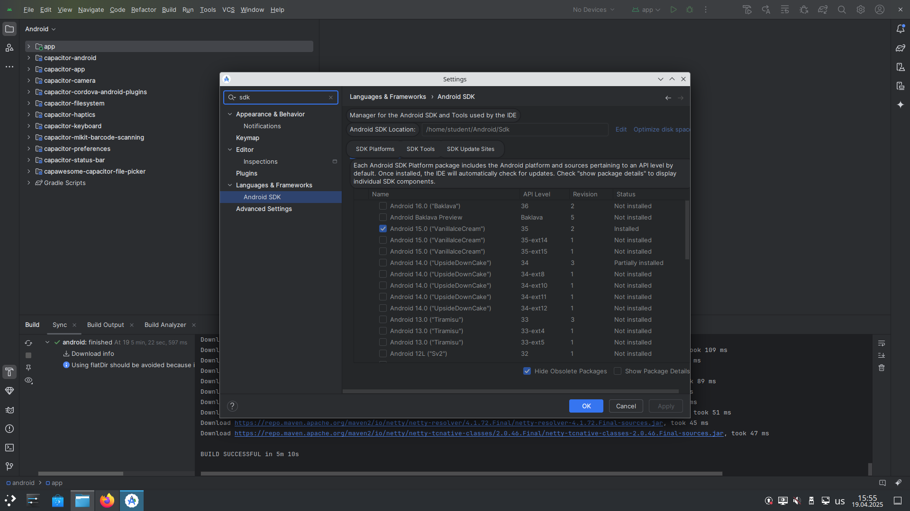
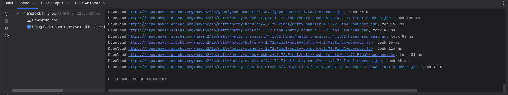
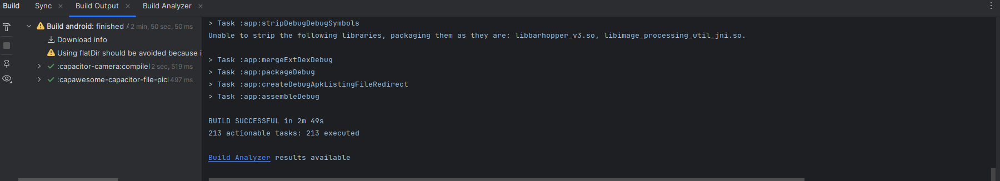

# КАК СДЕЛАТЬ БИЛД ДЛЯ ANDROID
1. В консоли корневой папки программы нужно написать
```
ionic build prod
```
```
ionic capacitor add android
```
2. Открыть папку "android" в папке программы при помощи "android studio", зайти в "file->settings" найти "Build, Execution, Deployment -> Build Tools -> Gradle" и поменять настройки в соответсвии с картинкой 
3. Там же в "Settings" найти "Android SDK" и в поле "Android SDK Location" поставить "/home/studet/Android/Sdk" Полем ниже выбрать "Android 15.0 ("VanillaIceCream") api level = 35" всё это изображено на рисунке 
4. Удостовериться что "Sync" выполнился

5. Запустить создание билда

